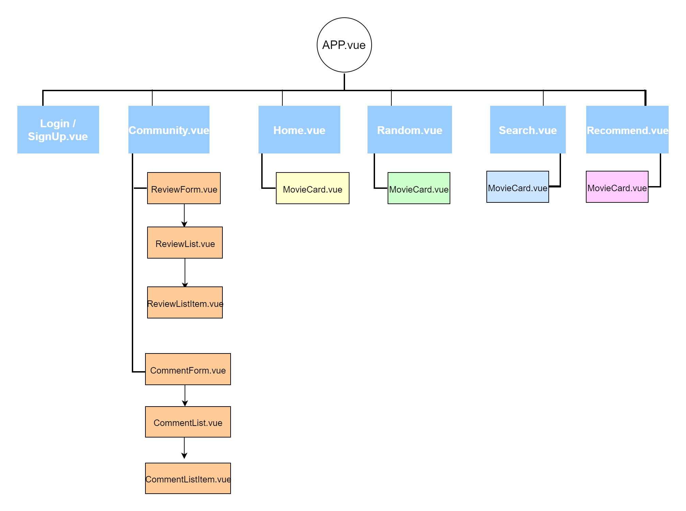
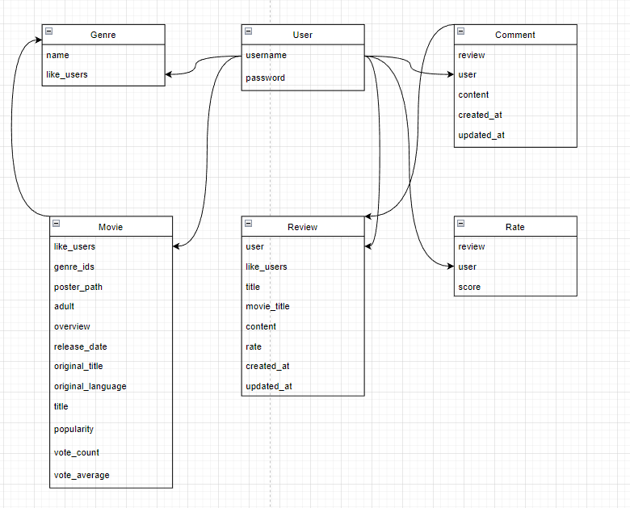

# ===== Final PJT =====

> # 팀 9조
  팀장 : 지이주`[ 총괄 Backend 전담(Django, Vue) ]`  
  팀원 : 장진문`[ Frontend 전담(Vue, CSS) ]`

# 사용 기술
- Django, Vue.js, Python, CSS, HTML  
 

# 서비스 구현 목표 및 실제 구현 정도
> ## 서비스 구현 목표
    1. 영화 조회
        - 영화 검색
        - 평점순 영화
        - 개봉일 순 최신영화 조회
    2. 영화 추천
        - 유저의 선호 장르(유저 선택)에 따른 영화 추천
    3. 리뷰 게시판
        - 영화에 대한 리뷰 게시판
        - 댓글과 좋아요 기능

> ## 실제 구현
    1. 영화 조회
        - 전체 조회(랜덤)
        - 영화 개봉일과 평점순 영화 조회
        - 영화 상세 정보 조회
        - 영화 검색
    2. 영화 추천
        - 유저가 선택한 장르에 따른 영화 리스트 출력
    3. 리뷰 게시판
        - 영화에 대한 리뷰를 작성하는 게시판 생성
        - 댓글과 좋아요 기능 생성

> ## ERD
> 
> 

> # 프로젝트 진행  
    > ## 1. Front, back pjt 설치, django를 이용해 영화 데이터를 받아 보여주기
   - backend : Movies, accounts, community 앱 생성
     - Movies
       - index => 전체 영화조회
       - detail => 영화 세부사항
       - random => 무작위 랜덤 선택
       - recommend => 선택 장르에 맞는 영화 리스트
     - accounts
       - signup => 회원가입
       - login, logout => 로그인과 로그아웃
     - community : 영화에 대한 리뷰를 달 수 있는 게시판
       - review_create => 게시글 목록 조회 및 생성
       - review_update_delete => 단일 review 조회 및 수정, 삭제
       - comment_create => 댓글 목록 조회 및 생성
       - comment_update_delete => 단일 comment 조회 및 수정, 삭제

> ## 2. DB 생성
    `TMDB` 사이트의 `API key`를 통해서 데이터를 받아온 후, json 파일을 만들어 loaddata해 사용

> ## 3. django를 완성시킨 후 vue를 이용해 페이지 구성 설계
  - ### <b>frontend : components와 router를 이용해 프론트 설계</b>

    - ## COMPONENTS
      - ### movies
        - MovieCard.vue : 영화의 전체적인 정보 보여주기
      - ### community
        - ReviewForm, List, ListItem : 영화 리뷰를 보여주는 기능
        - CommentForm, List, ListItem : 리뷰 페이지의 댓글 기능

    - ## VIEWS
      - ### accounts
        - Signup, Login.vue : 회원 가입과 로그인 기능
      - ### community
        - Community.vue : 리뷰 게시판 기능 
      - ### movies
        - Home.vue : 메인 페이지(TMDB_API에서 반환된 영화리스트를 출력)
        - Random.vue : 정렬 없이 랜덤으로 출력, 선택없이 상세 페이지 출력
        - Search.vue : 키워드에 따른 영화 검색
      - ### recommend
        - Recommend.vue : 장르선택 드롭박스, 선택한 장르에 맞는 영화 추천

> # 영화 추천 알고리즘에 대한 기술적 설명
    lodash를 이용한 랜덤추천과 장르별 평점순 추천

> # 서비스 대표 기능에 대한 설명
    ㅇㅇ

> # 후기
`지이주` : 학기동안 배운 내용들을 최대한 활용해 프로젝트를 진행해 보았는데 기억이 나지 않는 부분도 많았고, 알고 있다고 생각했던 부분에서도 헷갈렸던 부분이 많았습니다. 프로젝트를 진행하면서 학기동안 배운 내용을 복습을 목표로 프로젝트를 진행하였고 처음부터 만드는 것은 오랜만이라 잊고있었던 데이터베이스 다루는 법 부터 vue 까지 다시한번 더 복습할 수 있었습니다.  
  
`장진문` : 수업 시간에 정해진 실습만 하다가 직접 기획하고 구현하는 프로젝트를 진행하게 되었는데 
제가 느낀 부분은 실습은 답이 있기 때문에 따라갈 수 있지만  프로젝트는 답이 없고, 직접 구상하고 진행하는 것이기 때문에 더욱 어려웠다고 느꼈습니다.
또한 아직 아는 부분보다 모르는 부분이 많다는 걸 다시 한번 알게 되었습니다.
꾸준히 개인 공부를 해서 뒤쳐지지 않고 어떤 프로젝트를 진행하게 되었을 때 한 사람의 몫을 제대로 해내는 사람이 되자고 생각했습니다. 수고하셨습니다.

